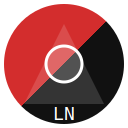

<!-- En-tête centré : titre, logo, badges -->
<p align="center">
  
  <br>
  <span style="display:block;font-size:2.5em;font-weight:bold;margin:10px 0 8px 0;">Libernav</span>
  
  
  
</p>

---

<p align="center"><b>Statut : expérimental, en développement</b></p>

---

<p align="center">
  Navigateur web "anarchiste" basé sur Electron et Vite.<br>
  <i>Confidentialité, minimalisme, open source.</i>
</p>

---

## Prérequis

- <b>Uniquement Linux</b>
- Node.js >= 18
- npm
- Tor (optionnel, pour l’intégration Tor)

---

## Fonctionnalités principales

- Navigation privée par défaut
- Blocage des trackers
- Intégration Tor
- Interface minimaliste
- Open source

---

## Installation (Linux)

<details>
<summary><b>Voir les étapes</b></summary>

1. <b>Prérequis</b> :
   - Node.js >= 18
   - npm
   - Tor (optionnel, pour l’intégration Tor)

2. <b>Cloner le dépôt</b>

   ```bash
   git clone <url-du-repo>
   cd Libernav
   ```

3. <b>Installer les dépendances</b>

   ```bash
   npm install
   ```

4. <b>Démarrer en mode développement</b>

   ```bash
   npm run dev
   ```

</details>

---

## Statut

- Ce projet est expérimental et en cours de développement.
- Utilisation à vos risques et périls.

---

## Licence

MIT
# LIBERNAV
